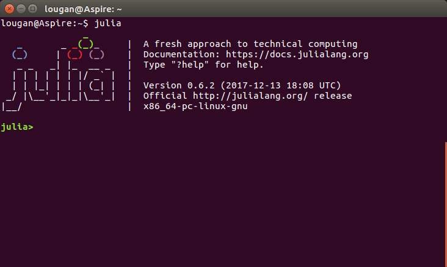
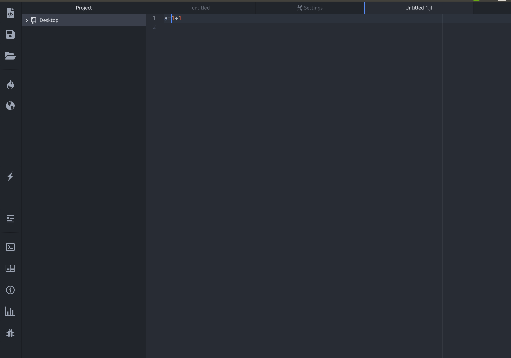
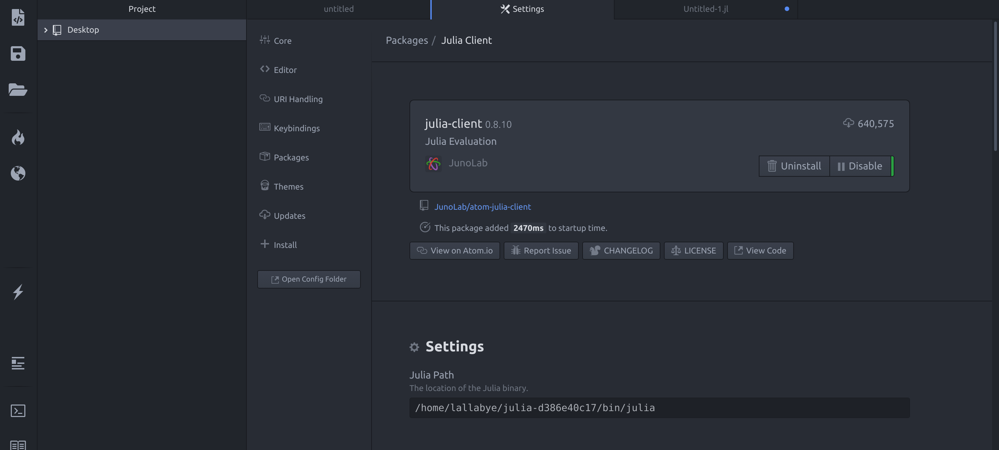

# NGSIM-tools
This repository collects a set of tools for extracting, visualizing, and simulating Next Generation Simulation (NGSIM) dataset. The tools are originally developed by Stanford Intelligent Systems Laboratory (SISL).  
Please check their github repositories on https://github.com/sisl

If you are working on your research and plan to publish papers, please check the original places of these packages and cite their work there. Thank you. (disclaimer: I am not affiliate with SISL.)


## Demo: What these tools can do?


## Why do we need this recollection?
Successfully running the tools for dealing with NGSIM requires packages which are mutually dependent but scattered in different repositories. Since each repository undergoes active development, directly cloning the master branch of the repositories results in version conflicts, which are, trust me, frustrating.

## What is in this repository?
While do not claim any originality, in this repository we make sure you can find all you need to run the tools for dealing with NGSIM dataset. Specifically, the following are included.
1. The packages you will need:
    - Records v0.6.0 (branch 0.6_legacy)
    - Vec v0.6.0 (branch 0_6)
    - AutomotiveDriving v0.6.0
    - AutoViz v0.6.0
    - NGSIM v1.1.0
    
    The dependency between the packages, base on my understanding, looks like the following diagram. 
    
      
      
2. The installation procedure

3. The collection of tutorials on how to using the tools.

However, you do need to download the following files from other repositories. This is because they are too large, I cannot include them here. They are
- Julia v0.6.2
- NGSIM data

I will let you know how to clone or download these files.

## Installation procedure:

### First, install julia v0.6.2
If we want to install julia using command line, using the following code. I use Ubuntu 16.04.6. 
```bash
# Let us install julia in home directory.
cd ~
# Now we install julia-0.6.2
wget https://julialang-s3.julialang.org/bin/linux/x64/0.6/julia-0.6.2-linux-x86_64.tar.gz
tar -xf julia-0.6.2-linux-x86_64.tar.gz
# Clean the installation file.
rm julia-0.6.2-linux-x86_64.tar.gz
# Add the path to the system PATH variable
echo "export PATH=$(pwd)/julia-d386e40c17/bin:\$PATH" >> ~/.bashrc
# Rerun .bashrc to update the changes
source ~/.bashrc
```
### Second, install packages of NGSIM-tools
#### Preinstall some required packages.
Install some packages to ubuntu 16.04 in case they are not there already. In the terminal, do the following.
```bash
sudo apt-get install libavcodec-ffmpeg56
sudo apt-get install libavformat-ffmpeg56
sudo apt-get install libavfilter-ffmpeg5
sudo apt-get install libavdevice-ffmpeg56
```
Open julia by typing `julia` in your terminal. Make sure the version of julia should be v0.6.2.
```julia
julia
>> Pkg.add("StaticArrays")
>> Pkg.add("Reexport")
>> Pkg.add("Colors")
>> Pkg.add("DataFrames")
>> Pkg.add("Parameters")
>> Pkg.add("ElectronDisplay")
>> Pkg.add("Distributions")
>> quit()
```
These commands will automatically create a new directory: `~/.julia/v0.6/` This directory is important. It is where all your packages are saved. 
When adding the above packages, their dependencies are automatically downloaded. Hence, it may take a longer time. Be patient. 

#### Install the NGSIM-tools packages locally
The following steps are not as elegent. I want to install julia packages from specific branches or tags of certain github repositories, and I do not know how to make it happen in julia v0.6 by using `Pkg.clone(url)`. I did try `Pkg.clone(url, packagename); Pkg.checkout(packagename, branch)` and it did not work for me. 

Instead, as a work around, I will show you how to download the zip files of the packages and install the zip files locally into julia v0.6. 

Download the NGSIM-tools.zip from the website to your `~/Downloads/` folder. If you prefer command lines, use the following.
```bash
cd ~/Downloads/
git clone https://github.com/LongshengJiang/NGSIM-tools.git
```
Open the downloaded `NGSIM-tools/zipped_packages` folder.
```bash
cd ~/Downloads/NGSIM-tools/zipped_packages
```
Recall when we used `Pkg.add()` in julia, julia automatically created a directory `~/.julia/v0.6/` to place the packages. We will unzip the newly downloaded files directly to that directory. In your terminal, type
```bash
# unzip Vec.zip
unzip ~/Downloads/NGSIM-tools/zipped_packages/Vec.zip -d ~/.julia/v0.6/
# unzip Records.zip
unzip ~/Downloads/NGSIM-tools/zipped_packages/Records.zip -d ~/.julia/v0.6/
# unzip AutomotiveDrivingModels.zip
unzip ~/Downloads/NGSIM-tools/zipped_packages/AutomotiveDrivingModels.zip -d ~/.julia/v0.6/
# unzip AutoViz.zip
unzip ~/Downloads/NGSIM-tools/zipped_packages/AutoViz.zip -d ~/.julia/v0.6/
# unzip NGSIM.zip
unzip ~/Downloads/NGSIM-tools/zipped_packages/NGSIM.zip -d ~/.julia/v0.6/
```
The above commands work like `Pkg.add()` in julia, I guess but not sure. 

Go to directory `~/.julia/v0.6/`
```bash
cd ~/.julia/v0.6/
```
Check if the module name has version extensions, for example, `Vec.jl-0.6.0`. This should be change to `Vec`. 
If such version extension exists, we need manual remove it by using the following
```bash
mv Vec.jl-0_6/ Vec/
mv Records.jl-0.6-legacy/ Records/
mv AutomotiveDrivingModels.jl-0.6.0/ AutomotiveDrivingModels/
mv AutoViz.jl-0.6.0/ AutoViz/
mv NGSIM.jl-1.1.0/ NGSIM/
```

#### Download NGSIM data
Go to the directory where the data should be placed.
```bash
cd ~/.julia/v0.6/NGSIM/data/
```
Download and unzip the data
```bash
wget https://github.com/sisl/NGSIM.jl/releases/download/v1.0.0/data.zip
unzip data.zip
# Answer yes to any that ask to be replaced.
```
Please remember to create trajectories from the raw data.
```julia
# Create trajectories from the data
julia
  >> using NGSIM
  >> convert_raw_ngsim_to_trajdatas()
  >> quit()
# This may take very long time. Be patient.  
```

#### Check package installation
Check if the five packages are successfully installed.
```julia
>> using Vec
# Wait to see any errors pop up. 
>> using Records
# Wait to see any errors pop up.
>> using AutomotiveDrivingModels
# Wait to see any errors pop up.
>> using AutoViz
# Wait to see any errors pop up.
>> using NGSIM
# Wait to see any errors pop up.
```
Furthermore, you can run tests on these packages.
```julia
>> Pkg.test("Vec")
# Wait to see any errors pop up. 
>> Pkg.test("Records")
# Wait to see any errors pop up. 
>> Pkg.test("AutomotiveDrivingModels")
# Wait to see any errors pop up. 
>> Pkg.test("AutoViz")
# Wait to see any errors pop up. 
>> Pkg.test("NGSIM")
# Wait to see any errors pop up. 
```
If all the tests passed, you can now start to follow the tutorials to learn the tools. 

## Tutorials
I assume you use your julia terminal (REPL) to practice on the tutorials. You need to go to your julia by typing 
```bash
julia
```
in the terminal. Then, on this webpage you go to the folder `\tutorials\` and start your learning from there. I hope your learning journey is much smoother than mine. 



## Using Atom to work with Julia
I personally don't think working with Julia in the terminal is convenient and cool. I prefer using an color coded editor or, if possible, a full functioning IDE.
While the latest version of Julia has these tools available, people who are stuck with Julia v0.6 are not so lucky. We have to use OLD versions of editors and so far I have not find a debugger for Julia v0.6. If you know one, please email me at longshj@g.clemson.edu. I really appreciate your help. 
Here is my selection of tools after much research on the internet.

I use Atom v1.27.0. You can find this old version here: [https://github.com/atom/atom/releases/tag/v1.27.0](https://github.com/atom/atom/releases/tag/v1.27.0). I use ubuntu 16.04, hence, I downloaded `atom-amd64.deb`. You can choose the files according to your platform. 

I then install the packages of Atom for using julia. I use uber-juno, but we need to be careful about the versions. We cannot directly use the latest version. To add the juno packages, go to`Edit`--> `Preference`. Here among a column of items, select `Install`. In the search box, input `uber_juno@0.3.0`. Find this result and click on `install`. This step would install several packages, but you might have an error regarding installing `julia-client`. We cannot use the default version of this package. I tried several versions and settle at `julia_client@0.8.10`. You put this string in the search box. Find this result and install. So far you would be set. I attach a summary of the packages here for your convenience: 

    - atom v1.27.0
    - indent-detective@0.4.0
    - ink@0.12.5
    - julia-client@0.8.10
    - latex-completions@0.3.6
    - uber-juno@0.3.0

Hopefully, you will see an interface like this when you open Atom


Last step, don't forget to change the path to julia binary in julia-client. We want want the path to be the julia v0.6 we have downloaded previously. We need to find the setting of julia-client by `Edit` --> `Preference` --> `packages`. Then go find julia-client, and presss the setting icon (a gear). You would see the screen looking like this.

