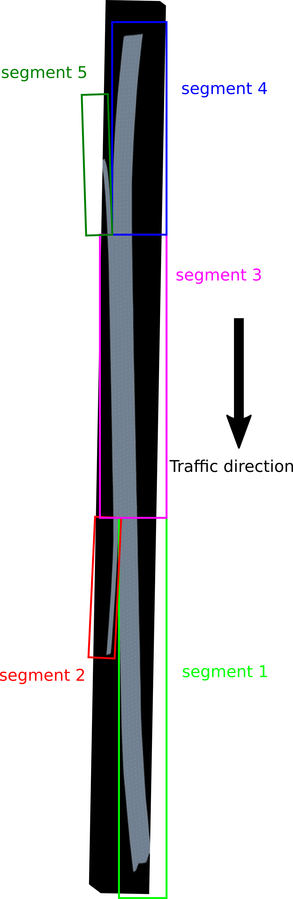
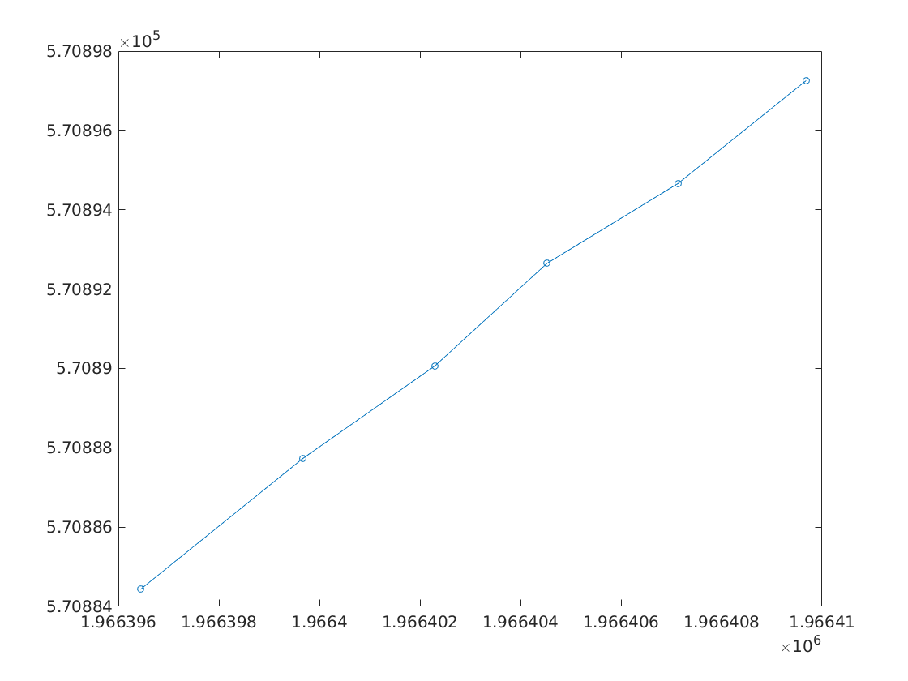

In this document, I will explain the segments labeling and lane labeling of US 101. This information is important if you want to investigate the lane changing behaviors of the vehicles, thus needing the lane information. 

NGSIM_tools transfer the raw road information in NGSIM dataset to a customized data structure, hence the lanes are relabeled. First, the road was divided into 5 segmented as follows.



Don't believe it? It's okay. Here is how I figure it out. Try it out by yourselves. We first use the `NGSIM` module
```julia
julia> using NGSIM
```
This module export the us_101 as a roadway object. The roadway type is defined in `AutomotiveDrivingModels` module. This object's name is `ROADWAY_101`. We can always use `fieldnames(ROADWAY_101)` to check its fields.
```julia
julia> fieldnames(ROADWAY_101)
1-element Array{Symbol,1}:
 :segments
```
We can keep using `fieldnames` and go deeper.
```julia
julia> fieldnames(ROADWAY_101.segments)
0-element Array{Symbol,1}
```
Here we see `:segments` is an object with no fields. We can check it size
```julia
julia> size(ROADWAY_101.segments)
(5,)
```
It has 5-elements. Hence, `ROADWAY_101` has 5 segment. We check the first segment.
```julia
julia> fieldnames(ROADWAY_101.segments[1])
2-element Array{Symbol,1}:
 :id   
 :lanes
```
We can check the id of this segment by typing
```julia
julia> ROADWAY_101.segments[1].id
3
```
We know this is the segment 3. We can further go deeper to explore these fields.
```julia
julia> fieldnames(ROADWAY_101.segments[1].id)
0-element Array{Symbol,1}

julia> fieldnames(ROADWAY_101.segments[1].lanes)
0-element Array{Symbol,1}

julia> size(ROADWAY_101.segments[1].id)
()

julia> size(ROADWAY_101.segments[1].lanes)
(6,)
```
Hence, we know the first segment of `RAODWAY_101` has 6 lanes. This segment (segment 3) must be part of the middle section of the road in the above picture. We want to see what the fields of the lanes are.
```julia
julia> fieldnames(ROADWAY_101.segments[1].lanes[1])
8-element Array{Symbol,1}:
 :tag           
 :curve         
 :width         
 :speed_limit   
 :boundary_left 
 :boundary_right
 :exits         
 :entrances   
 ```
 Here we can find the tag of the lane. Let's see what a tag is.
 ```julia
julia> fieldnames(ROADWAY_101.segments[1].lanes[1].tag)
2-element Array{Symbol,1}:
 :segment
 :lane  
 ```
 A tag tells us the segment number and the lane number. 
 Let's see what `:exits` and `:entrances` tell us.
 ```julia
 julia> fieldnames(ROADWAY_101.segments[1].lanes[1].exits[1])
3-element Array{Symbol,1}:
 :downstream
 :mylane    
 :target    

julia> fieldnames(ROADWAY_101.segments[1].lanes[1].exits[1].target)
2-element Array{Symbol,1}:
 :ind
 :tag
 
 julia> fieldnames(ROADWAY_101.segments[1].lanes[1].entrances[1])
3-element Array{Symbol,1}:
 :downstream
 :mylane    
 :target    

julia> fieldnames(ROADWAY_101.segments[1].lanes[1].entrances[1].target)
2-element Array{Symbol,1}:
 :ind
 :tag
 ```
 We can see `:exits` and `:entrances` tells us the tags of the lanes connecting to the exit and entrance of this lane. Let's see an example.
 ```julia
julia> ROADWAY_101.segments[1].lanes[1].tag
LaneTag(3, 1)

julia> ROADWAY_101.segments[1].lanes[1].exits
1-element Array{AutomotiveDrivingModels.LaneConnection,1}:
 LaneConnection(D, CurveIndex(825, 1.000), RoadIndex({1, 0.000000}, {2, 1})

julia> ROADWAY_101.segments[1].lanes[1].entrances
1-element Array{AutomotiveDrivingModels.LaneConnection,1}:
 LaneConnection(U, CurveIndex(1, 0.000), RoadIndex({227, 1.000000}, {5, 1})
 ```
 We see the current lane is (segment 3, lane 1). At its downstream is (segment 2, lane 1). At its upstream is (segment 5, lane 1). So where is segment 2 and 5 in the picture?
 
We find here 
```julia
julia> fieldnames(ROADWAY_101.segments[1].lanes[1])
8-element Array{Symbol,1}:
 :tag           
 :curve         
 :width         
 :speed_limit   
 :boundary_left 
 :boundary_right
 :exits         
 :entrances   
 ```
 The lane has information about its left and right boundary. Let us see what they are.
 ```julia
 julia> ROADWAY_101.segments[1].id
3

julia> ROADWAY_101.segments[1].lanes[1].tag
LaneTag(3, 1)
 
julia> ROADWAY_101.segments[1].lanes[1].boundary_left
AutomotiveDrivingModels.LaneBoundary(:broken, :white)

julia> ROADWAY_101.segments[1].lanes[1].boundary_right
AutomotiveDrivingModels.LaneBoundary(:solid, :white)
```
Great, they can tell us the line shape and color of the boundaries. We know solid line is at road edges. From the information above, we see (segment 3, lane 1) is on the right edge of the middle section of the road. Let us check the bourndaries of the two connected lanes: (segment 2, lane 1) and (segment 5, lane 1).
```julia
julia> ROADWAY_101.segments[3].lanes[1].tag
LaneTag(2, 1)

julia> ROADWAY_101.segments[3].lanes[1].boundary_left
AutomotiveDrivingModels.LaneBoundary(:solid, :white)

julia> ROADWAY_101.segments[3].lanes[1].boundary_right
AutomotiveDrivingModels.LaneBoundary(:solid, :white)
```
We see (segment 2, lane 1), which is at the downstream of (segment 3, lane 1), has both boundaries being solid line, hence it is a ramp. Since it is at the downstream, it is a off-ramp as in the picture. We do the samething for the upper stream.
```julia
julia> ROADWAY_101.segments[5].lanes[1].tag
LaneTag(5, 1)

julia> ROADWAY_101.segments[5].lanes[1].boundary_left
AutomotiveDrivingModels.LaneBoundary(:solid, :white)

julia> ROADWAY_101.segments[5].lanes[1].boundary_right
AutomotiveDrivingModels.LaneBoundary(:solid, :white)
```
Based on this information, (segment 5, lane 1) has to be the on-ramp. And (segment 3) can be seen to occupy the whole middle section of the road. 

We can also check the curve field of the lane.
```julia
ROADWAY_101.segments[5].lanes[1].curve[1]
CurvePt({1966340.040, 570926.571, -0.391}, 0.000, -0.000, -0.024)
```
We see the curve contains curve points, which is define in `AutonomousDrivingModels` module as
```julia
struct CurvePt
    pos::VecSE2 # global position and orientation
    s::Float64  # distance along the curve
    k::Float64  # curvature
    kd::Float64 # derivative of curvature

    CurvePt(pos::VecSE2, s::Float64, k::Float64=NaN, kd::Float64=NaN) = new(pos, s, k, kd)
end
```
We can compare the globale positions of different lanes on segment 3.
```julia
julia> ROADWAY_101.segments[1].lanes[1].tag
LaneTag(3, 1)
julia> ROADWAY_101.segments[1].lanes[2].tag
LaneTag(3, 2)
julia> ROADWAY_101.segments[1].lanes[3].tag
LaneTag(3, 3)
julia> ROADWAY_101.segments[1].lanes[4].tag
LaneTag(3, 4)
julia> ROADWAY_101.segments[1].lanes[5].tag
LaneTag(3, 5)
julia> ROADWAY_101.segments[1].lanes[6].tag
LaneTag(3, 6)

julia> ROADWAY_101.segments[1].lanes[1].curve[1]
CurvePt({1966396.442, 570884.431, -0.690}, 0.000, -0.000, -0.000)
julia> ROADWAY_101.segments[1].lanes[2].curve[1]
CurvePt({1966399.668, 570887.728, -0.739}, 0.000, -0.000, -0.000)
julia> ROADWAY_101.segments[1].lanes[3].curve[1]
CurvePt({1966402.299, 570890.065, -0.662}, 0.000, -0.000, -1.564)
julia> ROADWAY_101.segments[1].lanes[4].curve[1]
CurvePt({1966404.529, 570892.650, -0.752}, 0.000, -0.000, 0.007)
julia> ROADWAY_101.segments[1].lanes[5].curve[1]
CurvePt({1966407.137, 570894.664, -0.722}, 0.000, -0.000, -0.007)
julia> ROADWAY_101.segments[1].lanes[6].curve[1]
CurvePt({1966409.684, 570897.257, -0.701}, 0.000, 0.000, -0.045)
```
We plot these points out from lane 1 to lane 6, here is what we got



We can see lanes on segment 3 are placed one next to another from lane 1 to lane 6, which is from right to left when following the direction of the road.
We now want to see what is connected at the upstream of segment 3. Let us run
```julia
julia> ROADWAY_101.segments[1].id
3
julia> ROADWAY_101.segments[1].lanes[1].entrances[1].target
RoadIndex({227, 1.000000}, {5, 1})
julia> ROADWAY_101.segments[1].lanes[2].entrances[1].target
RoadIndex({564, 1.000000}, {4, 1})
julia> ROADWAY_101.segments[1].lanes[3].entrances[1].target
RoadIndex({559, 1.000000}, {4, 2})
julia> ROADWAY_101.segments[1].lanes[4].entrances[1].target
RoadIndex({559, 1.000000}, {4, 3})
julia> ROADWAY_101.segments[1].lanes[5].entrances[1].target
RoadIndex({559, 1.000000}, {4, 4})
julia> ROADWAY_101.segments[1].lanes[6].entrances[1].target
RoadIndex({554, 1.000000}, {4, 5})
```
We find segment 4 is indeed at the upstream of segment 3, with (segment 4, lane 1)--(segment 3, lane 2),...,(segment 4, lane 5)--(segment 3, lane 6).
This is illustrated in the following picture.


```julia
julia> ROADWAY_101.segments[1].id
3
julia> ROADWAY_101.segments[1].lanes[1].exits[1].target
RoadIndex({1, 0.000000}, {2, 1})
julia> ROADWAY_101.segments[1].lanes[2].exits[1].target
RoadIndex({1, 0.000000}, {1, 1})
julia> ROADWAY_101.segments[1].lanes[3].exits[1].target
RoadIndex({1, 0.000000}, {1, 2})
julia> ROADWAY_101.segments[1].lanes[4].exits[1].target
RoadIndex({1, 0.000000}, {1, 3})
julia> ROADWAY_101.segments[1].lanes[5].exits[1].target
RoadIndex({1, 0.000000}, {1, 4})
julia> ROADWAY_101.segments[1].lanes[6].exits[1].target
RoadIndex({1, 0.000000}, {1, 5})
```
We find segment 1 is indeed at the downstream of segment 3. with (segment 3, lane 2)--(segment 1, lane 1),...,(segment 3, lane 6)--(segment 1, lane 5).
This is illustrated in the following picture.
